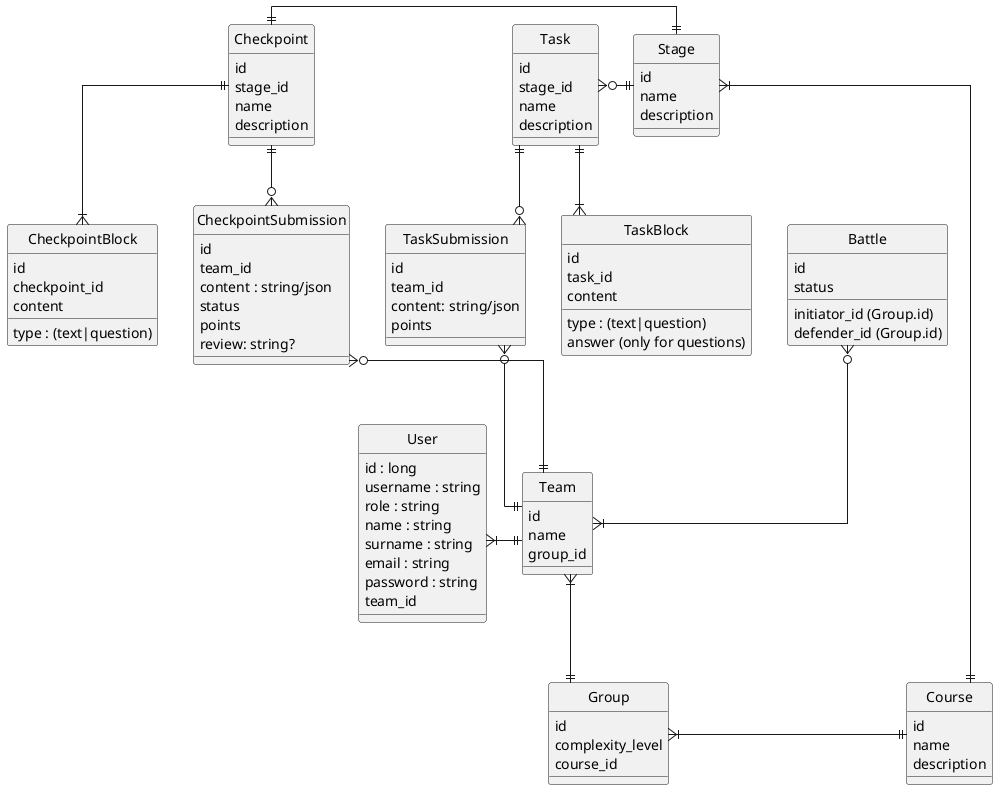

```plantuml
@startuml
' hide the spot
hide circle

' avoid problems with angled crows feet
skinparam linetype ortho

entity User {
    id : long
    username : string
    role : string
    name : string
    surname : string
    email : string
    password : string
    team_id
}

entity Team {
    id
    name
    group_id
}
'unique (name, group_id)

entity Group {
    id
    complexity_level
    course_id
}

entity Course {
    id
    name
    description
}

entity Stage {
    id
    name
    description
}

entity Task {
    id
    stage_id
    name
    description
}

entity TaskBlock {
    id
    task_id
    type : (text|question)
    content
    answer (only for questions)
}

entity CheckpointBlock {
    id
    checkpoint_id
    type : (text|question)
    content
}

entity Checkpoint {
    id
    stage_id
    name
    description
}

entity TaskSubmission {
    id
    team_id
    content: string/json
    points
}

entity CheckpointSubmission {
    id
    team_id
    content : string/json
    status
    points
    review: string?
}

entity Battle {
    id
    initiator_id (Group.id)
    defender_id (Group.id)
    status
}

User }|-right-|| Team
Team }|--|| Group
Group }|-right-|| Course
Course ||-left-|{ Stage
Stage ||-left-o{ Task
Stage ||-left-|| Checkpoint
Task ||--|{ TaskBlock
Task ||--o{ TaskSubmission
TaskSubmission }o--|| Team
Checkpoint ||--|{ CheckpointBlock
Checkpoint ||--o{ CheckpointSubmission
CheckpointSubmission }o--|| Team
Battle }o--|{ Team
@enduml
```

